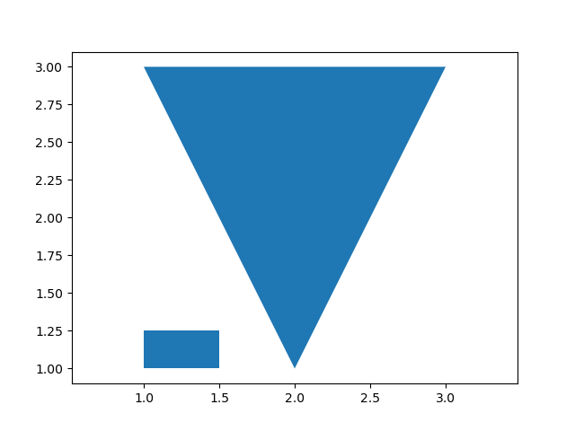
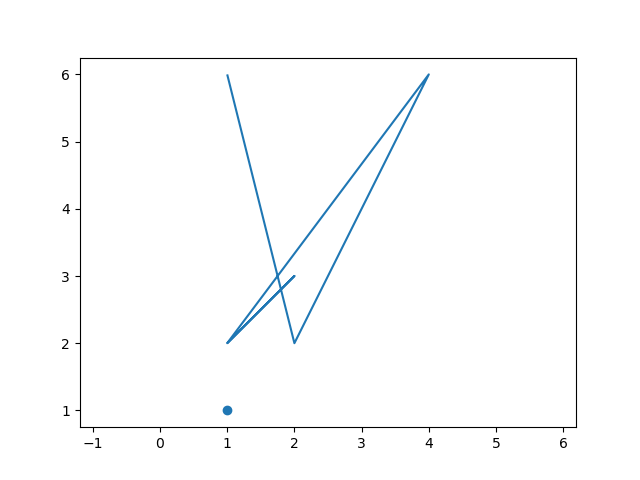
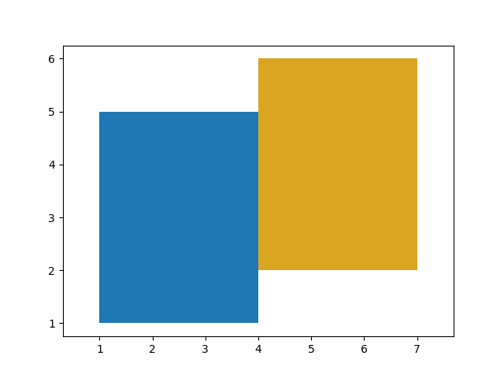
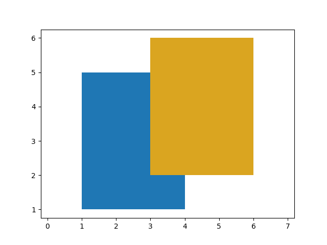
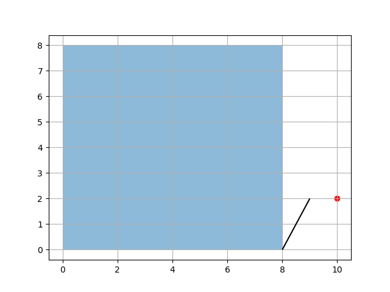
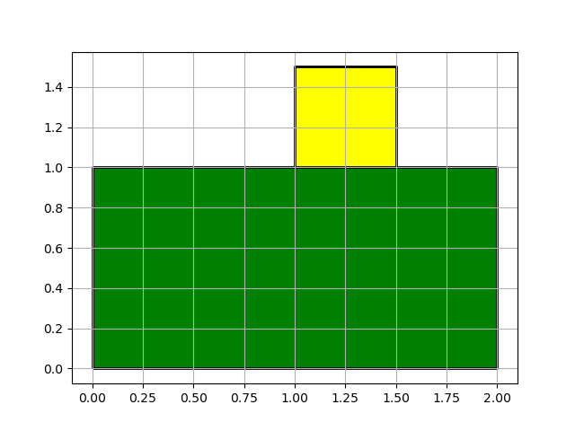

# 几何体的基本操作

Arctern 实现了多个符合 OGC 标准的 GIS 处理函数。它们被封装成 GeoSeries 类的属性和方法。其中的方法又分为一元操作方法和二元操作方法。

## GeoSeries.length

* **功能：** 计算 GeoSeries 对象中每个几何体的长度。如果几何体不是 LineString 和 MultiLineString 类型的几何体， 则它的长度为 0 。
* **返回：** 浮点型的 pandas.Series

```python
>>> from arctern import GeoSeries
>>> s = GeoSeries(["POINT(1 1)", "LINESTRING (0 0, 0 2)", "POLYGON ((0 0,0 4,4 4,0 0))"])
>>> s.length
0    0.0
1    2.0
2    0.0
dtype: float64
```

## GeoSeries.area

* **功能：** 计算 GeoSeries 对象中每个几何体的面积。
* **返回：** 浮点型的 pandas.Series

```python
>>> from arctern import GeoSeries
>>> s = GeoSeries(["POINT(1 1)", "POLYGON ((2 1, 3 3, 1 3, 2 1))"])
>>> s.area
0    0.0
1    2.0
dtype: float64
```


## GeoSeries.centroid

* **功能：** 计算 GeoSeries 对象中每个几何体的中心点。
* **返回：** GeoSeries。

```python
>>> from arctern import GeoSeries
>>> s = GeoSeries(["POLYGON ((1 1, 1.5 1, 1.5 1.25, 1 1.25, 1 1))", "POLYGON ((2 1, 3 3, 1 3, 2 1))"])
>>> s.centroid
0              POINT (1.25 1.125)
1    POINT (2.0 2.33333333333333)
dtype: float64
```


## GeoSeries.is_valid

* **功能：** 判断 GeoSeries 对象中的每个几何体是否有效。
* **返回：** 布尔型的 pandas.Series
  * **True：** 几何体有效。
  * **False：** 几何体无效。

```python
>>> from arctern import GeoSeries
>>> s = GeoSeries(["POINT(1 1)", "POINT(1)"])
>>> s.is_valid
0     True
1    False
dtype: bool
```

## GeoSeries.is_simple

* **功能：** 判断 GeoSeries 对象中的每个几何体是否简单。这里的“简单”表示某个几何图形没有异常的几何图形点，例如自相交或相切。
* **返回：** 布尔型的 pandas.Series
  * **True：** 几何体是简单的。
  * **False：** 几何体不是简单的。

```python
>>> from arctern import GeoSeries
>>> s = GeoSeries(["POINT(1 1)", "LINESTRING (1 2,2 3,1 2,4 6,2 2,1 6)"])
>>> s.is_simple
0     True
1    False
dtype: bool
```


## GeoSeries.convex_hull

* **功能：** 对于 GeoSeries 对象中的每个几何体，计算包围它的最小的凸几何体。
* **返回：** GeoSeries

```python
>>> from arctern import GeoSeries
>>> s = GeoSeries(["POINT(1 1)", "POLYGON ((2 1, 5 1, 6 5, 4 2, 1 5, 2 1))"])
>>> s.convex_hull
0                        POINT (1 1)
1    POLYGON ((2 1,1 5,6 5,5 1,2 1))
dtype: GeoDtype
```


## GeoSeries.npoints

* **功能：** 对于 GeoSeries 对象中的每个几何体，计算它的点的数量。
* **返回：** int64 类型的 pandas.Series

```python
>>> from arctern import GeoSeries
>>> s = GeoSeries(["POINT(1 1)", "POLYGON ((1 1, 3 1, 3 3, 1 3, 1 1))"])
>>> s.npoints
0    1
1    5
dtype: int64
```

## GeoSeries.curve_to_line

* **功能：** 对于 GeoSeries 对象中的每个几何体，计算它的近似表示。近似表示的方法是将每个几何图形中的曲线转换为近似线性表示。
* **返回：** GeoSeries

```python
>>> from arctern import GeoSeries
>>> s = GeoSeries(["CURVEPOLYGON(CIRCULARSTRING(0 0, 4 0, 4 4, 0 4, 0 0))"])
>>> s.curve_to_line()
0    POLYGON ((0 0,0.144384846968599 -0.1346410480079,0.297810064436987 -0.258882339403264,0.459528180167908 -0.372118583103131,0.628751319757384 -0.473798103510646,0.804655045079528 -0.563425528223178,0.986382370866408 -0.640564201436803,1.17304793985397 -0.704838311289649,1.36374233615356 -0.755934720779265,1.55753651583507 -0.793604493334868,1.75348633313513 -0.817664105611044,1.9506371402407 -0.827996341595309,2.14802843823713 -0.824550863672528,2.34469855656221 -0.807344457864786,2.53968933816861 -0.776460952051593,2.73205080756895 -0.732050807568896,2.92084579902018 -0.674330386176507,3.10515452230186 -0.603580895965422,3.28407904384051 -0.520147021340222,3.45674766135266 -0.424435243751333,3.6223191506906 -0.316911861358278,3.7799868642013 -0.198100717271856,3.92898266063321 -0.068580647443195,4.06858064744324 0.071017339366811,4.19810071727193 0.220013135798766,4.31691186135845 0.377680849309456,4.42443524375153 0.543252338647363,4.52014702134033 0.715920956159607,4.60358089596548 0.894845477698254,4.67433038617651 1.07915420097987,4.73205080756907 1.26794919243116,4.77646095205159 1.46031066183144,4.80734445786493 1.65530144343791,4.82455086367258 1.85197156176298,4.82799634159551 2.04936285975941,4.81766410561113 2.24651366686498,4.7936044933349 2.44246348416505,4.75593472077935 2.63625766384655,4.70483831128968 2.82695206014614,4.64056420143697 3.0136176291337,4.56342552822321 3.19534495492053,4.47379810351072 3.37124868024273,4.3721185831032 3.54047181983219,4.2588823394035 3.70218993556301,4.13464104800801 3.85561515303141,4 4,3.85561515303141 4.13464104800801,3.70218993556307 4.25888233940338,3.54047181983219 4.3721185831032,3.37124868024273 4.47379810351072,3.19534495492053 4.56342552822321,3.0136176291337 4.64056420143697,2.82695206014614 4.70483831128968,2.63625766384655 4.75593472077935,2.44246348416505 4.7936044933349,2.24651366686498 4.81766410561113,2.04936285975941 4.82799634159551,1.85197156176298 4.82455086367258,1.65530144343791 4.80734445786493,1.46031066183144 4.77646095205159,1.26794919243116 4.73205080756907,1.07915420097987 4.67433038617651,0.894845477698254 4.60358089596548,0.715920956159607 4.52014702134033,0.543252338647363 4.42443524375153,0.377680849309442 4.31691186135845,0.220013135798759 4.19810071727193,0.071017339366808 4.06858064744324,-0.068580647443198 3.92898266063321,-0.198100717271863 3.7799868642013,-0.316911861358292 3.6223191506906,-0.424435243751333 3.45674766135266,-0.520147021340222 3.28407904384051,-0.603580895965422 3.10515452230175,-0.674330386176507 2.92084579902018,-0.732050807568896 2.73205080756895,-0.776460952051593 2.53968933816861,-0.807344457864786 2.34469855656221,-0.824550863672528 2.14802843823713,-0.827996341595309 1.9506371402407,-0.817664105611044 1.75348633313513,-0.793604493334868 1.55753651583507,-0.755934720779265 1.36374233615356,-0.704838311289649 1.17304793985397,-0.640564201436803 0.986382370866408,-0.563425528223178 0.804655045079528,-0.473798103510646 0.628751319757356,-0.372118583103131 0.459528180167908,-0.258882339403271 0.29781006443698,-0.134641048007893 0.144384846968599,0 0))
dtype: GeoDtype
```


## GeoSeries.simplify(tolerance)

* **功能：** 对于 GeoSeries 对象中的每个几何体，计算它的简化表示。简化表示的算法是 Douglas-Peucker 算法。
* **参数：** `tolerance` 为浮点型数字，表示线串上的点和曲线之间的最大距离。
* **返回：** GeoSeries

```python
>>> from arctern import GeoSeries
>>> s = GeoSeries(["POLYGON ((1 1,1 2,2 2,2 1,1 1))", "CIRCULARSTRING (0 0,1 1,2 0)"])
>>> s.simplify(1.0)
0    POLYGON ((1 1,1 2,2 2,2 1,1 1))
1               LINESTRING (0 0,2 0)
dtype: GeoDtype
```

## GeoSeries.envelope

* **功能：** 对于 GeoSeries 对象中的每个几何体，计算它的最小矩形边界范围。
* **返回：** GeoSeries

```python
>>> from arctern import GeoSeries
>>> s = GeoSeries(["POINT(1 1)", "POLYGON ((4.76 3.16, 3.67 5.17, 2.85 2.21, 4.04 0.99, 7.00 2.83))"])
>>> s.envelope
0                                                    POINT (1 1)
1    POLYGON ((2.85 0.99,2.85 5.17,7.0 5.17,7.0 0.99,2.85 0.99))
dtype: GeoDtype
```


## GeoSeries.buffer(distance)

* **功能：** 对于 GeoSeries 对象中的每个几何体，创建一个与它的最远距离不大于 `distance` 的几何体。
* **参数：** `distance` 为浮点型数字，表示新几何体与原几何体之间的最大距离。
* **返回：** GeoSeries

### 示例 1

将 `distance` 设为 0，则返回一个空的多边形。

```python
>>> from arctern import GeoSeries
>>> s = GeoSeries(["POINT (0 1)"])
>>> s.buffer(0.0)
0    POLYGON EMPTY
dtype: GeoDtype
```
### 示例 2

将 `distance` 设为 1.0，则返回一个多边形。该多边形近似表示一个半径为 1.0、圆心为 `Point(0, 1)` 的圆，该圆的面积为近似为 3.14。

```python
>>> from arctern import GeoSeries
>>> s = GeoSeries(["POINT (0 1)"])
>>> result = s.buffer(1.0)
>>> result
0    POLYGON ((1 1,0.998629534754574 0.947664043757056,0.994521895368273 0.895471536732347,0.987688340595138 0.843565534959769,0.978147600733806 0.792088309182241,0.965925826289068 0.741180954897479,0.951056516295154 0.690983005625053,0.933580426497202 0.6416320504547,0.913545457642601 0.5932633569242,0.891006524188368 0.546009500260454,0.866025403784439 0.5,0.838670567945424 0.455360964984973,0.809016994374948 0.412214747707527,0.777145961456971 0.370679608950163,0.743144825477395 0.330869393641142,0.707106781186548 0.292893218813453,0.669130606358859 0.256855174522606,0.629320391049838 0.22285403854303,0.587785252292474 0.190983005625053,0.544639035015028 0.161329432054576,0.5 0.133974596215562,0.453990499739548 0.108993475811633,0.406736643075801 0.0864545423574,0.358367949545302 0.066419573502799,0.309016994374949 0.048943483704847,0.258819045102522 0.034074173710932,0.207911690817761 0.021852399266195,0.156434465040233 0.012311659404863,0.104528463267656 0.005478104631727,0.052335956242946 0.001370465245426,0.0 0.0,-0.052335956242941 0.001370465245426,-0.104528463267651 0.005478104631726,-0.156434465040228 0.012311659404862,-0.207911690817756 0.021852399266194,-0.258819045102518 0.034074173710931,-0.309016994374944 0.048943483704845,-0.358367949545297 0.066419573502797,-0.406736643075797 0.086454542357398,-0.453990499739544 0.10899347581163,-0.5 0.13397459621556,-0.544639035015024 0.161329432054574,-0.58778525229247 0.19098300562505,-0.629320391049834 0.222854038543026,-0.669130606358855 0.256855174522603,-0.707106781186544 0.292893218813449,-0.743144825477391 0.330869393641138,-0.777145961456968 0.370679608950159,-0.809016994374944 0.412214747707523,-0.838670567945421 0.455360964984969,-0.866025403784436 0.5,-0.891006524188365 0.546009500260448,-0.913545457642599 0.593263356924195,-0.9335804264972 0.641632050454694,-0.951056516295152 0.690983005625047,-0.965925826289067 0.741180954897473,-0.978147600733804 0.792088309182235,-0.987688340595137 0.843565534959763,-0.994521895368273 0.89547153673234,-0.998629534754574 0.94766404375705,-1.0 1.0,-0.998629534754574 1.05233595624294,-0.994521895368274 1.10452846326765,-0.987688340595139 1.15643446504022,-0.978147600733807 1.20791169081775,-0.96592582628907 1.25881904510251,-0.951056516295156 1.30901699437494,-0.933580426497205 1.35836794954529,-0.913545457642604 1.40673664307579,-0.891006524188372 1.45399049973954,-0.866025403784443 1.5,-0.838670567945429 1.54463903501502,-0.809016994374952 1.58778525229247,-0.777145961456976 1.62932039104983,-0.7431448254774 1.66913060635885,-0.707106781186554 1.70710678118654,-0.669130606358865 1.74314482547739,-0.629320391049845 1.77714596145697,-0.58778525229248 1.80901699437494,-0.544639035015034 1.83867056794542,-0.5 1.86602540378443,-0.453990499739554 1.89100652418836,-0.406736643075807 1.9135454576426,-0.358367949545307 1.9335804264972,-0.309016994374954 1.95105651629515,-0.258819045102528 1.96592582628907,-0.207911690817766 1.9781476007338,-0.156434465040237 1.98768834059514,-0.10452846326766 1.99452189536827,-0.05233595624295 1.99862953475457,-0.0 2.0,0.052335956242939 1.99862953475457,0.104528463267649 1.99452189536827,0.156434465040226 1.98768834059514,0.207911690817755 1.97814760073381,0.258819045102517 1.96592582628907,0.309016994374944 1.95105651629515,0.358367949545297 1.9335804264972,0.406736643075797 1.9135454576426,0.453990499739544 1.89100652418837,0.5 1.86602540378444,0.544639035015025 1.83867056794543,0.587785252292471 1.80901699437495,0.629320391049836 1.77714596145697,0.669130606358857 1.7431448254774,0.707106781186547 1.70710678118655,0.743144825477394 1.66913060635886,0.777145961456971 1.62932039104984,0.809016994374947 1.58778525229247,0.838670567945424 1.54463903501503,0.866025403784439 1.5,0.891006524188368 1.45399049973955,0.913545457642601 1.4067366430758,0.933580426497202 1.3583679495453,0.951056516295154 1.30901699437495,0.965925826289069 1.25881904510252,0.978147600733806 1.20791169081776,0.987688340595138 1.15643446504023,0.994521895368274 1.10452846326765,0.998629534754574 1.05233595624294,1 1))
dtype: GeoDtype
>>> result.area
0    3.140157
dtype: float64
```


## GeoSeries.precision_reduce(precision)

* **功能：** 对于 GeoSeries 对象中的每个几何体，根据指定的有效数字位数 `precision` 创建降低坐标精度后的几何体。
* **参数：** `precision` 为整型数字，表示有效数字位数。
* **返回：** GeoSeries

以下示例中，由于设置的有效位数是 3， 结果中所有点的坐标只保留了 3 位有效数字。其中 POINT (1.333 2.666) 的坐标 2.666 的最后有效位采用四舍五入的规则，变为 2.67 。

```python
>>> from arctern import GeoSeries
>>> s = GeoSeries(["POINT (1.333 2.666)", "POINT (2.655 4.447)"])
>>> s.precision_reduce(3)
0    POINT (1.33 2.67)
1    POINT (2.66 4.45)
dtype: GeoDtype
```

## GeoSeries.make_valid

* **功能：** 对于 GeoSeries 对象中的每个几何体，根据它创建一个新的有效的几何体。在构造新几何体过程中，不会删除原始几何体的任何顶点。如果原始几何体本来就是有效的，则直接返回原始几何体。
* **返回：** GeoSeries

在以下示例中，输入的几何体在 POINT (2 2) 附近存在自相交的情况。因此，`make_valid` 方法返回一个新的几何体集合，该集合包含一个多边形和一个线串。

```python
>>> from arctern import GeoSeries
>>> s = GeoSeries(["POLYGON ((2 1,3 1,3 2,2 2,2 8,2 1))"])
>>> s.make_valid()
Warning 1: Self-intersection at or near point 2 2
0    GEOMETRYCOLLECTION (POLYGON ((2 2,3 2,3 1,2 1,2 2)),LINESTRING (2 2,2 8))
dtype: GeoDtype
```

## GeoSeries.intersects(other)

* **功能：** 对于 GeoSeries 对象中的每个几何体，判断它是否与 `other` 对象中相同位置的几何体存在交集。
* **参数：** `other` 为 GeoSeries 或者 WKB 类型的对象。
* **返回：** 布尔型的 pandas.Series
  * **True：** 两个几何体存在交集。
  * **False：** 两个几何体不存在交集。

### 示例 1
```python
>>> from arctern import GeoSeries
>>> s1 = GeoSeries(["POLYGON((7 7,9 4,5 4,7 7))", "POLYGON((8 0,9 0,9 1,8 1,8 0))"])
>>> s2 = GeoSeries(["POLYGON((6 6,2 6,2 2,6 2,6 6))", "POLYGON((0 0,0 4,4 4,4 0,0 0))"])
>>> s2.intersects(s1)
0     True
1    False
dtype: bool
```


### 示例 2
```python
>>> from arctern import GeoSeries
>>> s1 = GeoSeries(["POLYGON((7 7,9 4,5 4,7 7))"])
>>> s2 = GeoSeries(["POLYGON((6 6,2 6,2 2,6 2,6 6))", "POLYGON((0 0,0 4,4 4,4 0,0 0))"])
>>> s2.intersects(s1[0])
0     True
1    False
dtype: bool
```


### 示例 3
```python
>>> from arctern import GeoSeries
>>> s1 = GeoSeries(["POLYGON((8 0,9 0,9 1,8 1,8 0))"])
>>> s2 = GeoSeries(["POLYGON((6 6,2 6,2 2,6 2,6 6))", "POLYGON((0 0,0 4,4 4,4 0,0 0))"])
>>> s2.intersects(s1[0])
0    False
1    False
dtype: bool
```


## GeoSeries.within(other)

* **功能：** 对于 GeoSeries 对象中的每个几何体，判断它是否在 `other` 对象中相同位置的几何体的内部。
* **参数：** `other` 为 GeoSeries 或者 WKB 类型的对象。
* **返回：** 布尔型的 pandas.Series
  * **True：** 两个几何体存在包含关系。
  * **False：** 两个几何体存在包含关系。

```python
>>> s1 = GeoSeries(["POLYGON((1 1, 4 1, 4 4, 1 4, 1 1))", "POLYGON((5 1, 7 1, 7 3, 5 3, 5 1))", "POLYGON((8 1, 9 1, 9 2, 8 2, 8 1))"])
>>> s2 = GeoSeries(["POLYGON((2 2, 2 3, 3 3, 3 2, 2 2))", "POLYGON((5 4, 6 2, 7 4, 5 4))", "POLYGON((8 3, 9 3, 9 4, 8 4, 8 3))"])
>>> s2.within(s1)
0     True
1    False
2    False
dtype: bool
```


## GeoSeries.contains(other)

* **功能：** 对于 GeoSeries 对象中的每个几何体，判断它是否包含 `other` 对象中相同位置的几何体。
* **参数：** `other` 为 GeoSeries 或者 WKB 类型的对象。
* **返回：** 布尔型的 pandas.Series
  * **True：** 两个几何体存在包含关系。
  * **False：** 两个几何体存在包含关系。

```python
>>> from arctern import GeoSeries
>>> s1 = GeoSeries(["POLYGON((2 2, 2 3, 3 3, 3 2, 2 2))", "POLYGON((5 4, 6 2, 7 4, 5 4))", "POLYGON((8 3, 9 3, 9 4, 8 4, 8 3))"])
>>> s2 = GeoSeries(["POLYGON((1 1, 4 1, 4 4, 1 4, 1 1))", "POLYGON((5 1, 7 1, 7 3, 5 3, 5 1))", "POLYGON((8 1, 9 1, 9 2, 8 2, 8 1))"])
>>> s2.contains(s1)
0     True
1    False
2    False
dtype: bool
```


## GeoSeries.crosses(other)

* **功能：** 对于 GeoSeries 对象中的每个几何体，判断它是否与 `other` 对象中相同位置的几何体相交。
* **参数：** `other` 为 GeoSeries 或者 WKB 类型的对象。
* **返回：** 布尔型的 pandas.Series
  * **True：** 两个几何体存在相交关系。
  * **False：** 两个几何体存在相交关系。

```python
>>> from arctern import GeoSeries
>>> s1 = GeoSeries(["POLYGON((1 1, 4 1, 4 4, 1 4, 1 1))", "POLYGON((1 1, 4 1, 4 4, 1 4, 1 1))"])
>>> s2 = GeoSeries(["LINESTRING(1 5, 5 1)", "POLYGON((2 2, 5 2, 5 5, 2 5, 2 2))"])
>>> s2.crosses(s1)
0     True
1    False
dtype: bool
```


## GeoSeries.geom_equals(other)

* **功能：** 对于 GeoSeries 对象中的每个几何体，判断它是否与 `other` 对象中相同位置的几何体等价。“等价”表示两个几何体的几何结构相同。
* **参数：** `other` 为 GeoSeries 或者 WKB 类型的对象。
* **返回：** 布尔型的 pandas.Series
  * **True：** 两个几何体等价。
  * **False：** 两个几何体不等价。

```python
>>> from arctern import GeoSeries
>>> s1 = GeoSeries(["POLYGON((0 0,1 0,1 1,0 1,0 0))", "POLYGON((8 0,9 0,9 1,8 1,8 0))"])
>>> s2 = GeoSeries(["POLYGON((0 0,0 8,8 8,8 0,0 0))", "POLYGON((0 0,0 8,8 8,8 0,0 0))"])
>>> s2.geom_equals(s1)
0    False
1    False
dtype: bool
```

## GeoSeries.touches(other)

* **功能：** 对于 GeoSeries 对象中的每个几何体，判断它是否与 `other` 对象中相同位置的几何体相邻。“相邻”表示两个几何体在边界上有共同的点。
* **参数：** `other` 为 GeoSeries 或者 WKB 类型的对象。
* **返回：** 布尔型的 pandas.Series
  * **True：** 两个几何体等价。
  * **False：** 两个几何体不等价。

```python
>>> from arctern import GeoSeries
>>> s1 = GeoSeries(["POLYGON((1 1, 4 1, 4 5, 1 5, 1 1))"])
>>> s2 = GeoSeries(["POLYGON((4 2, 7 2, 7 6, 4 6, 4 2))"])
>>> s2.touches(s1)
0    True
dtype: bool
```



## GeoSeries.overlaps(other)

* **功能：** 对于 GeoSeries 对象中的每个几何体，判断它是否与 `other` 对象中相同位置的几何体重叠。“重叠”表示两个几何体相交且不互相包含。
* **参数：** `other` 为 GeoSeries 或者 WKB 类型的对象。
* **返回：** 布尔型的 pandas.Series
  * **True：** 两个几何体等价。
  * **False：** 两个几何体不等价。

```python
>>> from arctern import GeoSeries
>>> s1 = GeoSeries(["POLYGON((1 1, 4 1, 4 5, 1 5, 1 1))"])
>>> s2 = GeoSeries(["POLYGON((3 2, 6 2, 6 6, 3 6, 3 2))"])
>>> s2.overlaps(s1)
0    True
dtype: bool
```



## GeoSeries.distance(other)

* **功能：** 对于 GeoSeries 对象中的每个几何体，判断它与 `other` 对象中相同位置的几何体之间的最短二维笛卡尔（平面）距离。
* **参数：** `other` 为 GeoSeries 或者 WKB 类型的对象。
* **返回：** 浮点型的 pandas.Series

```python
>>> from arctern import GeoSeries
>>> s1 = GeoSeries(["LINESTRING(8 0,9 2)", "POINT(10 2)"])
>>> s2 = GeoSeries(["POLYGON((0 0,0 8,8 8,8 0,0 0))", "POLYGON((0 0,0 8,8 8,8 0,0 0))"])
>>> s2.distance(s1)
0    1.0
1    2.0
dtype: float64
```


## GeoSeries.distance_sphere(other)

* **功能：** 对于 GeoSeries 对象中的每个几何体，根据经纬度坐标计算地球表面两点之间的最短球面距离。该方法使用 SRID 定义的地球和半径。
* **参数：** `other` 为 GeoSeries 或者 WKB 类型的对象。
* **返回：** 浮点型的 pandas.Series

```python
>>> from arctern import GeoSeries
>>> s1 = GeoSeries(["POINT(10 2)"], crs="EPSG:4326")
>>> s2 = GeoSeries(["POINT(10 3)"], crs="EPSG:4326")
>>> s2.distance_sphere(s1)
0    111226.3
dtype: float64
```

## GeoSeries.hausdorff_distance(other)

* **功能：** 对于 GeoSeries 对象中的每个几何体，判断它与 `other` 对象中相同位置的几何体之间的 Hausdorff 距离。此距离用于度量两个几何体之间的相似度。
* **参数：** `other` 为 GeoSeries 或者 WKB 类型的对象。
* **返回：** 浮点型的 pandas.Series

```python
>>> from arctern import GeoSeries
>>> s1 = GeoSeries(["POLYGON((0 0 ,0 1, 1 1, 1 0, 0 0))", "POINT(0 0)"])
>>> s2 = GeoSeries(["POLYGON((0 0 ,0 2, 1 1, 1 0, 0 0))", "POINT(0 1)"])
>>> s2.hausdorff_distance(s1)
0    1.0
1    1.0
dtype: float64
```


## GeoSeries.intersection(other)

* **功能：** 对于 GeoSeries 对象中的每个几何体，计算它与 `other` 对象中相同位置的几何体之间交集。
* **参数：** `other` 为 GeoSeries 或者 WKB 类型的对象。
* **返回：** GeoSeries

```python
>>> from arctern import GeoSeries
>>> s1 = GeoSeries(["POLYGON ((1 1,1 2,2 2,2 1,1 1))"])
>>> s2 = GeoSeries(["POLYGON ((2 1,3 1,3 2,2 2,2 1))"])
>>> s2.intersection(s1)
0    LINESTRING (2 2,2 1)
dtype: GeoDtype
```


## GeoSeries.polygon_from_envelope(min_x, min_y, max_x, max_y, crs=None)

* **功能：** 对于 GeoSeries 对象中的每个几何体，根据给定的参数计算它的最小矩形边界范围，且该矩形的边与坐标轴平行。
* **参数：**  
  * **min_x：** 浮点型的 pandas.Series，表示矩形横坐标的最小值。
  * **min_y：** 浮点型的 pandas.Series，表示矩形纵坐标的最小值。
  * **max_x：** 浮点型的 pandas.Series，表示矩形横坐标的最大值。
  * **max_y：** 浮点型的 pandas.Series，表示矩形纵坐标的最大值。
  * **crs：** （可选参数）字符串，比如“ESPG:4326”、“ESPG:3857”。
* **返回：** GeoSeries

```python
>>> from pandas import Series
>>> from arctern import GeoSeries
>>> min_x = Series([0.0, 1.0])
>>> max_x = Series([2.0, 1.5])
>>> min_y = Series([0.0, 1.0])
>>> max_y = Series([1.0, 1.5])
>>> GeoSeries.polygon_from_envelope(min_x, min_y, max_x, max_y)
0                POLYGON ((0 0,0 1,2 1,2 0,0 0))
1    POLYGON ((1 1,1.0 1.5,1.5 1.5,1.5 1.0,1 1))
dtype: GeoDtype
```


## GeoSeries.point(x, y)

* **功能：** 根据横坐标集合 `x` 和纵坐标集合 `y` 构造一组 POINT 对象。
* **参数：**  
  * **x：** 浮点型的 pandas.Series，表示一组点的横坐标。
  * **y：** 浮点型的 pandas.Series，表示一组点的纵坐标。
* **返回：** POINT

```python
>>> from pandas import Series
>>> from arctern import GeoSeries
>>> x = Series([1.3, 2.5])
>>> y = Series([1.3, 2.5])
>>> GeoSeries.point(x, y)
0    POINT (1.3 1.3)
1    POINT (2.5 2.5)
dtype: GeoDtype
```
