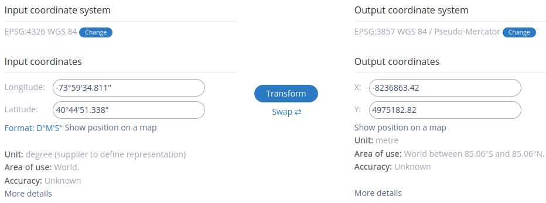
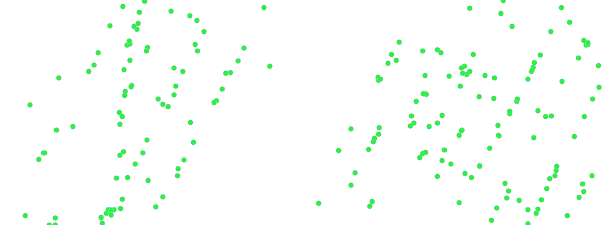
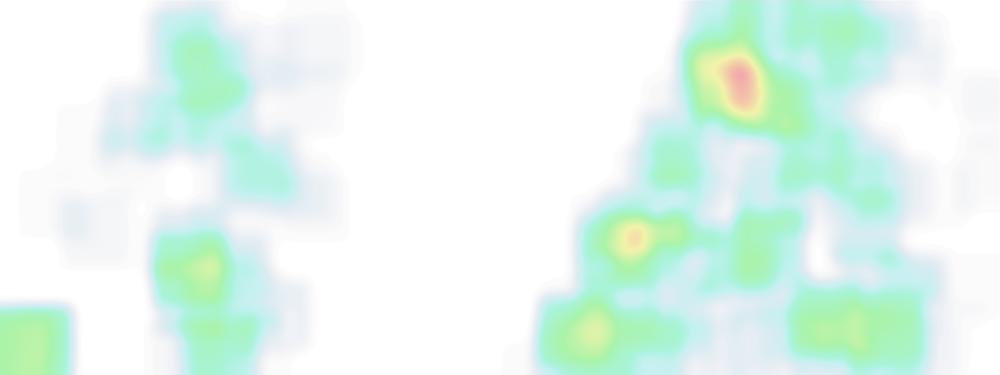
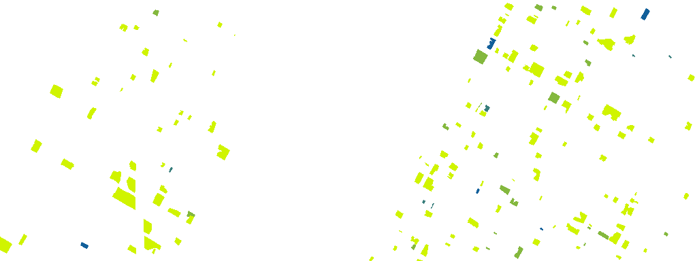

# 快速开始

本文以纽约出租车数据集为例，展示如何使用 Arctern 完成数据的导入、运算和展示。

## 数据准备

在 Arctern 运行环境中下载纽约出租车数据集。

```bash
$ wget https://media.githubusercontent.com/media/zilliztech/arctern-resources/benchmarks/benchmarks/dataset/nyc_taxi/0_2M_nyc_taxi_and_building/0_2M_nyc_taxi_and_building.csv
```

该数据集包含 2009 年纽约市出租车运营记录，各字段的含义如下：

| 名称                  | 含义                       | 类型   |
| :-------------------- | :------------------------- | :----- |
| VendorID              | 运营商名称                 | string |
| tpep_pickup_datetime  | 上车时间                   | string |
| tpep_dropoff_datetime | 下车时间                   | string |
| passenger_count       | 乘客数量                   | long   |
| trip_distance         | 行程距离                   | double |
| pickup_longitude      | 上车地点-经度              | double |
| pickup_latitude       | 上车地点-纬度              | double |
| dropoff_longitude     | 下车地点-经度              | double |
| dropoff_latitude      | 下车地点-纬度              | double |
| fare_amount           | 行程费用                   | double |
| tip_amount            | 小费                       | double |
| total_amount          | 总费用                     | double |
| buildingid_pickup     | 上车地点所在建筑的 id      | long   |
| buildingid_dropoff    | 下车地点所在建筑的 id      | long   |
| buildingtext_pickup   | 上车地点所在建筑的轮廓描述 | string |
| buildingtext_dropoff  | 下车地点所在建筑的轮廓描述 | string |

> **注意：** 该数据的时间格式为：`yyyy-MM-dd HH:mm::ss XXXXX`，如 `2009-04-12 03:16:33 +00:00`

## 加载数据

以下通过 Python 交互界面展示 Arctern 的使用方法。根据测试数据各字段的名称和数据类型，构建导入测试数据的 `schema`并导入数据。

```python
>>> import pandas as pd
>>> nyc_schema={
...     "VendorID":"string",
...     "tpep_pickup_datetime":"string",
...     "tpep_dropoff_datetime":"string",
...     "passenger_count":"int64",
...     "trip_distance":"double",
...     "pickup_longitude":"double",
...     "pickup_latitude":"double",
...     "dropoff_longitude":"double",
...     "dropoff_latitude":"double",
...     "fare_amount":"double",
...     "tip_amount":"double",
...     "total_amount":"double",
...     "buildingid_pickup":"int64",
...     "buildingid_dropoff":"int64",
...     "buildingtext_pickup":"string",
...     "buildingtext_dropoff":"string",
... }
# 文件路径配置为本地路径
>>> df=pd.read_csv("/path/to/0_2M_nyc_taxi_and_building.csv",
...                dtype=nyc_schema,
...                date_parser=pd.to_datetime,
...                parse_dates=["tpep_pickup_datetime","tpep_dropoff_datetime"])
```

打印数据的前五行，验证数据是否加载成功：

```python
>>> df.head()
  VendorID      tpep_pickup_datetime     tpep_dropoff_datetime  passenger_count  ...  buildingid_pickup  buildingid_dropoff  buildingtext_pickup                               buildingtext_dropoff
0      CMT 2009-04-12 03:16:33+00:00 2009-04-12 03:20:32+00:00                1  ...                  0                   0                 <NA>                                               <NA>
1      VTS 2009-04-14 11:22:00+00:00 2009-04-14 11:38:00+00:00                1  ...                  0              150047                 <NA>  POLYGON ((-73.9833003295812 40.7590607716671,-...
2      CMT 2009-04-15 09:34:58+00:00 2009-04-15 09:49:35+00:00                1  ...                  0                   0                 <NA>                                               <NA>
3      CMT 2009-04-30 18:58:19+00:00 2009-04-30 19:05:27+00:00                1  ...                  0              365034                 <NA>  POLYGON ((-73.9822052908304 40.7588972120254,-...
4      CMT 2009-04-26 13:03:04+00:00 2009-04-26 13:27:54+00:00                1  ...                  0                   0                 <NA>                                               <NA>

[5 rows x 16 columns]
```

## 数据过滤

在指定地理区域（经度范围：-73.991504 至 -73.945155；纬度范围：40.770759 至 40.783434）中随机选取 `200` 行数据。

```python
>>> pos1=(-73.991504, 40.770759)
>>> pos2=(-73.945155, 40.783434)
>>> limit_num=200
>>> df=df.dropna()
>>> pickup_df = df[(df.pickup_longitude>pos1[0]) & (df.pickup_longitude<pos2[0]) & (df.pickup_latitude>pos1[1]) & (df.pickup_latitude<pos2[1])]
>>> pickup_df = pickup_df.head(limit_num)
```

## 使用 Arctern 提供的 GeoSpatial 函数处理数据

导入 `arctern` 模块：

```python
>>> from arctern import *
```

根据经纬度数据创建坐标点数据：

```python
>>> ST_AsText(ST_Point(pickup_df.pickup_longitude, pickup_df.pickup_latitude)).head()
0    POINT (-73.959908 40.776353)
1    POINT (-73.955183 40.773459)
2    POINT (-73.989523 40.77129)
3    POINT (-73.988154 40.774829)
4    POINT (-73.982687 40.771625)
dtype: object
```

将坐标点数据使用的空间坐标系从 `EPSG:4326` 坐标系转换到 `EPSG:3857` 坐标系，更多不同空间坐标系标准的详细信息请查看[维基百科相关页面](https://en.wikipedia.org/wiki/Spatial_reference_system)。

```python
>>> ST_AsText(ST_Transform(ST_Point(pickup_df.pickup_longitude, pickup_df.pickup_latitude),'epsg:4326', 'epsg:3857')).head()
0    POINT (-8233179.29767736 4979409.53917853)
1    POINT (-8232653.31308336 4978984.12438949)
2    POINT (-8236476.0243972 4978665.29594441)
3    POINT (-8236323.6280143 4979185.5105596)
4    POINT (-8235715.04435814 4978714.5380168)
dtype: object
```
你可以在 [EPSG](http://epsg.io/transform#s_srs=4326&t_srs=3857) 网站上验证转换结果是否正确。




## 使用 Arctern 绘制图层

导入绘图需要使用的模块：

```python
>>> from arctern.util import save_png
>>> from arctern.util.vega import vega_pointmap, vega_weighted_pointmap, vega_heatmap, vega_choroplethmap, vega_icon, vega_fishnetmap
```

通过 Arctern 提供的绘图函数绘制点图图层：

```python
>>> # 绘制点大小为 10，点颜色为 #2DEF4A，点不透明度为 1 的点图图层。
>>> vega = vega_pointmap(1024, 384, bounding_box=[pos1[0], pos1[1], pos2[0], pos2[1]], point_size=10, point_color="#2DEF4A", opacity=1, coordinate_system="EPSG:4326")
>>> png = point_map_layer(vega, ST_Point(pickup_df.pickup_longitude, pickup_df.pickup_latitude))
>>> save_png(png, '/tmp/arctern_pointmap_pandas.png')
```

点图图层绘制结果如下：



通过 Arctern 提供的绘图函数绘制带权点图图层：

```python
>>> # 绘制带权点图图层，点的颜色根据 fare_amount 在 #115f9a ~ #d0f400 之间变化，点的大小根据 total_amount 在 15 ~ 50 之间变化。
>>> vega = vega_weighted_pointmap(1024, 384, bounding_box=[pos1[0], pos1[1], pos2[0], pos2[1]], color_gradient=["#115f9a", "#d0f400"], color_bound=[1, 50], size_bound=[3, 15], opacity=1.0, coordinate_system="EPSG:4326")
>>> png = weighted_point_map_layer(vega, ST_Point(pickup_df.pickup_longitude, pickup_df.pickup_latitude), color_weights=df.head(limit_num).fare_amount, size_weights=df.head(limit_num).total_amount)
>>> save_png(png, "/tmp/arctern_weighted_pointmap_pandas.png")
```

带权点图图层绘制结果如下：


通过 Arctern 提供的绘图函数绘制热力图图层：

```python
>>> # 绘制热力图图层。
>>> vega = vega_heatmap(1024, 384, bounding_box=[pos1[0], pos1[1], pos2[0], pos2[1]], map_zoom_level=13.0, coordinate_system="EPSG:4326")
>>> png = heat_map_layer(vega, ST_Point(pickup_df.pickup_longitude, pickup_df.pickup_latitude), df.head(limit_num).fare_amount)
>>> save_png(png, "/tmp/arctern_heatmap_pandas.png")
```

热力图图层绘制结果如下：



通过 Arctern 提供的绘图函数绘制轮廓图图层：

```python
>>> # 绘制轮廓图图层，轮廓的填充颜色根据 fare_amount 在 #115f9a ~ #d0f400 之间变化。
>>> vega = vega_choroplethmap(1024, 384, bounding_box=[pos1[0], pos1[1], pos2[0], pos2[1]], color_gradient=["#115f9a", "#d0f400"], color_bound=[2.5, 5], opacity=1.0, coordinate_system="EPSG:4326")
>>> png = choropleth_map_layer(vega, ST_GeomFromText(pickup_df.buildingtext_pickup), df.head(limit_num).fare_amount)
>>> save_png(png, "/tmp/arctern_choroplethmap_pandas.png")
```

轮廓图图层绘制结果如下：



通过 Arctern 提供的绘图函数绘制图标图图层：

```python
>>> # 绘制图标图图层,icon_path 配置为本地路径。
>>> vega = vega_icon(1024, 384, bounding_box=[pos1[0], pos1[1], pos2[0], pos2[1]], icon_path='/path/to/icon.png', coordinate_system="EPSG:4326")
>>> png = icon_viz_layer(vega, ST_Point(pickup_df.head(25).pickup_longitude, pickup_df.head(25).pickup_latitude))
>>> save_png(png, "/tmp/arctern_iconviz_pandas.png")
```

图标图图层绘制结果如下：


通过 Arctern 提供的绘图函数绘制渔网图图层：

```python
>>> # 绘制渔网图图层。
>>> vega = vega_fishnetmap(1024, 384, bounding_box=[pos1[0], pos1[1], pos2[0], pos2[1]], cell_size=8, cell_spacing=1, opacity=1.0, coordinate_system="EPSG:4326")
>>> png = fishnet_map_layer(vega, ST_Point(pickup_df.pickup_longitude, pickup_df.pickup_latitude), df.head(limit_num).fare_amount)
>>> save_png(png, "/tmp/arctern_fishnetmap_pandas.png")
```

渔网图图层绘制结果如下：


