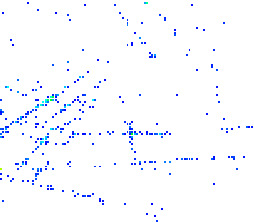

# Quick Start

本文以纽约出租车数据集为例，说明如何通过 `Arctern RESTful API` 完成数据的导入、运算和展示。

## 服务器端的启动和配置

### 服务器启动

在调用 `Arctern RESTful API` 之前请先启动服务，具体步骤详见[服务器启动](./webserver_installation_config.md)。

### 数据准备

在服务器端下载[纽约出租车数据集](https://media.githubusercontent.com/media/zilliztech/arctern-resources/benchmarks/benchmarks/dataset/nyc_taxi/0_2M_nyc_taxi_and_building/0_2M_nyc_taxi_and_building.csv)，该数据集包含 2009 年纽约市出租车运营记录，各字段的含义如下：

| 名称                  | 含义                       | 类型   |
| :-------------------- | :------------------------- | :----- |
| VendorID              | 运营商名称                 | string |
| tpep_pickup_datetime  | 上车时间                   | string |
| tpep_dropoff_datetime | 下车时间                   | string |
| passenger_count       | 乘客数量                   | long   |
| trip_distance         | 行程距离                   | double |
| pickup_longitude      | 上车地点-经度              | double |
| pickup_latitude       | 上车地点-纬度              | double |
| dropoff_longitude     | 下车地点-经度              | double |
| dropoff_latitude      | 下车地点-纬度              | double |
| fare_amount           | 行程费用                   | double |
| tip_amount            | 小费                       | double |
| total_amount          | 总费用                     | double |
| buildingid_pickup     | 上车地点所在建筑的 id      | long   |
| buildingid_dropoff    | 下车地点所在建筑的 id      | long   |
| buildingtext_pickup   | 上车地点所在建筑的轮廓描述 | string |
| buildingtext_dropoff  | 下车地点所在建筑的轮廓描述 | string |

> 该数据的时间格式为：`yyyy-MM-dd HH:mm::ss XXXXX`，如 `2009-04-12 03:16:33 +00:00`

下述示例中假设服务器 IP 地址为 `127.0.0.1`，RESTful 服务端口为 `8080`，数据文件所在路径为 `/example/data/0_2M_nyc_taxi_and_building.csv`。

### 安装依赖

本文示例代码使用 Python 的 `requests` 库调用 `Arctern RESTful API`，使用下面的命令安装 `requests`：

```shell
pip install requests
```

## API调用

### 创建作用域

使用 `/scope` 接口创建名为 `nyc_taxi` 的作用域。作用域用于为你分配服务器资源，每个作用域拥有独享的上下文信息，如载入的文件数据。

```python
>>> import requests
>>> import json
>>>
>>> payload = {"scope": "nyc_taxi"}
>>>
>>> r = requests.post(url="http://127.0.0.1:8080/scope", headers={"Content-Type": "application/json"}, data=json.dumps(payload))
>>> r.json()
{
    'code': 200,
    'message': 'create scope successfully!',
    'scope': 'nyc_taxi',
    'status': 'success'
}
```

### 数据导入

使用 `/loadfile` 接口导入纽约出租车数据集，将其对应的数据表命名为 `raw_data`，`scope` 字段使用先前创建的 `scope` 名称 `nyc_taxi`：

```python
>>> import requests
>>> import json
>>>
>>> payload = {\
    "scope": "nyc_taxi",\
    "tables": [\
        {\
            "name": "raw_data",\
            "format": "csv",\
            "path": "/example/data/0_2M_nyc_taxi_and_building.csv",\
            "options": {\
                "header": "True",\
                "delimiter": ","\
            },\
            "schema": [\
                {"VendorID": "string"},\
                {"tpep_pickup_datetime": "string"},\
                {"tpep_dropoff_datetime": "string"},\
                {"passenger_count": "long"},\
                {"trip_distance": "double"},\
                {"pickup_longitude": "double"},\
                {"pickup_latitude": "double"},\
                {"dropoff_longitude": "double"},\
                {"dropoff_latitude": "double"},\
                {"fare_amount": "double"},\
                {"tip_amount": "double"},\
                {"total_amount": "double"},\
                {"buildingid_pickup": "long"},\
                {"buildingid_dropoff": "long"},\
                {"buildingtext_pickup": "string"},\
                {"buildingtext_dropoff": "string"}\
            ]\
        }\
    ]\
}
>>>
>>> r = requests.post(url="http://127.0.0.1:8080/loadfile", headers={"Content-Type": "application/json"}, data=json.dumps(payload))
>>> r.json()
{
    'code': 200,
    'message': 'load table successfully!',
    'status': 'success'
}
>>> 
```

### 查询表信息

之前的操作在后台建了一张名为 `raw_data` 的表，使用 `/table/schema` 接口查询该表中各字段的名称以及对应的数据类型：

```python
>>> import requests
>>> r = requests.get(url="http://127.0.0.1:8080/table/schema?scope=nyc_taxi&table=raw_data")
>>> r.json()
{
    "code": 200,
    "schema": [
        {
            "col_name": "VendorID",
            "data_type": "string"
        },
        {
            "col_name": "tpep_pickup_datetime",
            "data_type": "string"
        },
        {
            "col_name": "tpep_dropoff_datetime",
            "data_type": "string"
        },
        {
            "col_name": "passenger_count",
            "data_type": "bigint"
        },
        {
            "col_name": "trip_distance",
            "data_type": "double"
        },
        {
            "col_name": "pickup_longitude",
            "data_type": "double"
        },
        {
            "col_name": "pickup_latitude",
            "data_type": "double"
        },
        {
            "col_name": "dropoff_longitude",
            "data_type": "double"
        },
        {
            "col_name": "dropoff_latitude",
            "data_type": "double"
        },
        {
            "col_name": "fare_amount",
            "data_type": "double"
        },
        {
            "col_name": "tip_amount",
            "data_type": "double"
        },
        {
            "col_name": "total_amount",
            "data_type": "double"
        },
        {
            "col_name": "buildingid_pickup",
            "data_type": "bigint"
        },
        {
            "col_name": "buildingid_dropoff",
            "data_type": "bigint"
        },
        {
            "col_name": "buildingtext_pickup",
            "data_type": "string"
        },
        {
            "col_name": "buildingtext_dropoff",
            "data_type": "string"
        }
    ],
    "status": "success",
    "table": "raw_data"
}
>>> 
```

### SQL查询

使用 `/query` 接口可完成数据表的创建、查询和删除操作。

#### 创建表

将 `raw_data` 中字符串格式的时间信息转换为 `timestamp` 类型的数据并移除与后续操作无关的字段，保存为一张新的表 `nyc_taxi`。

```python
>>> import requests
>>> import json
>>>
>>> payload = {\
    "scope": "nyc_taxi",\
    "session": "spark",\
    "sql": "create table nyc_taxi as (select VendorID, to_timestamp(tpep_pickup_datetime,'yyyy-MM-dd HH:mm:ss XXXXX') as tpep_pickup_datetime, to_timestamp(tpep_dropoff_datetime,'yyyy-MM-dd HH:mm:ss XXXXX') as tpep_dropoff_datetime, passenger_count, trip_distance, pickup_longitude, pickup_latitude, dropoff_longitude, dropoff_latitude, fare_amount, tip_amount, total_amount, buildingid_pickup, buildingid_dropoff, buildingtext_pickup, buildingtext_dropoff from raw_data where (pickup_longitude between -180 and 180) and (pickup_latitude between -90 and 90) and (dropoff_longitude between -180 and 180) and  (dropoff_latitude between -90 and 90))",\
    "collect_result": "0"\
}
>>>
>>> r = requests.post(url="http://127.0.0.1:8080/query", headers={"Content-Type": "application/json"}, data=json.dumps(payload))
>>> r.json()
{
    'code': 200,
    'message': 'execute sql successfully!',
    'status': 'success'
}
>>> 
```

#### 查询数据

查询 `nyc_taxi` 表的行数：

```python
>>> import requests
>>> import json
>>>
>>> sql = "select count(*) as num_rows from nyc_taxi"
>>> payload = {"scope": "nyc_taxi", "sql": sql, "collect_result": "1"}
>>>
>>> r = requests.post(url="http://127.0.0.1:8080/query", headers={"Content-Type": "application/json"}, data=json.dumps(payload))
>>> r.json()
{
    'code': 200,
    'message': 'execute sql successfully!',
    'result': [
        {'num_rows': 199999}
    ],
    'status': 'success'
}
>>> 
```

#### 删除表

删除原始表 `raw_data`：

```python
>>> import requests
>>> import json
>>>
>>> sql = "drop table if exists raw_data"
>>> payload = {"scope": "nyc_taxi", "sql": sql, "collect_result": "0"}
>>>
>>> r = requests.post(url="http://127.0.0.1:8080/query", headers={"Content-Type": "application/json"}, data=json.dumps(payload))
>>> r.json()
{
    'code': 200,
    'message': 'execute sql successfully!',
    'status': 'success'
}
>>> 
```

### 绘制点图

使用 `/pointmap` 接口根据乘客上车地点绘制点图。点图中具体参数说明请参见 [点图 RESTful API 说明](./api/function/pointmap.html)。

```python
>>> import requests
>>> import json
>>> 
>>> payload = {\
    "scope": "nyc_taxi",\
    "sql": "select ST_Point(pickup_longitude, pickup_latitude) as point from nyc_taxi where ST_Within(ST_Point(pickup_longitude, pickup_latitude), ST_GeomFromText('POLYGON ((-73.998427 40.730309, -73.954348 40.730309, -73.954348 40.780816 ,-73.998427 40.780816, -73.998427 40.730309))'))",\
    "params": {\
         "width": 1024,\
         "height": 896,\
        "bounding_box": [-73.998427, 40.730309, -73.954348, 40.780816],\
        "coordinate_system": "EPSG:4326",\
        "point_color": "#2DEF4A",\
        "point_size": 3,\
        "opacity": 0.5\
    }\
}
>>>
>>> r = requests.post(url="http://127.0.0.1:8080/pointmap", headers={"Content-Type": "application/json"}, data=json.dumps(payload))
>>> 
>>> # 保存为 PNG 图片
... 
>>> import base64
>>> with open("/tmp/pointmap.png", "wb") as f:
...     f.write(base64.b64decode(r.json()['result']))
... 
>>> 
```

在上述样例代码中，我们将点图数据保存在了 `/tmp/pointmap.png`。你可以在终端使用如下命令查看点图渲染效果：

```shell
eog /tmp/pointmap.png
```


### 带权点图

使用 `/weighted_pointmap` 接口根据乘客上车地点绘制带权点图，使用总费用作为点的权重，总费用越高，权重越大，点的颜色越深。权重图中具体参数说明请参见 [带权点图 RESTful API 说明](./api/function/weighted_pointmap.html)。

```python
>>> import requests
>>> import json
>>>
>>> payload = {\
    "scope": "nyc_taxi",\
    "session": "spark",\
    "sql": "SELECT ST_Point (pickup_longitude, pickup_latitude) AS point, total_amount AS color FROM nyc_taxi",\
    "type": "weighted",\
    "params": {\
        "width": 512,\
        "height": 448,\
        "bounding_box": [\
            -73.9616334766551,\
            40.704739019597156,\
            -73.94232850242967,\
            40.728133570887906\
        ],\
        "opacity": 0.8,\
        "coordinate_system": "EPSG:4326",\
        "size_bound": [\
            10\
        ],\
        "color_bound": [\
            2.5,\
            20\
        ],\
        "color_gradient": [\
            "#115f9a",\
            "#d0f400"\
        ]\
    }\
}
>>>
>>> r = requests.post(url="http://127.0.0.1:8080/weighted_pointmap", headers={"Content-Type": "application/json"}, data=json.dumps(payload))
>>> 
>>> import base64
>>> with open("/tmp/weighted_pointmap.png", "wb") as f:
...     f.write(base64.b64decode(r.json()['result']))
... 
>>> 
```

带权点图样例：

。

### 热力图

使用 `/heatmap` 接口根据乘客下车地点以及行程费用绘制热力图，费用高的区域为红色，费用低的区域为绿色。热力图中具体参数说明请参见 [热力图 RESTful API 说明](./api/function/heatmap.html)。

```python
>>> import requests
>>> import json
>>>
>>> payload = {\
    "scope": "nyc_taxi",\
    "session": "spark",\
    "sql": "SELECT ST_Point (dropoff_longitude, dropoff_latitude) AS point, avg(fare_amount) AS w FROM nyc_taxi GROUP BY point",\
    "params": {\
        "width": 512,\
        "height": 448,\
        "bounding_box": [\
            -74.01556543545699,\
            40.69354738164881,\
            -73.9434424136598,\
            40.780921656427836\
        ],\
        "coordinate_system": "EPSG:4326",\
        "map_zoom_level": 10,\
        "aggregation_type": "sum"\
    }\
}
>>>
>>> r = requests.post(url="http://127.0.0.1:8080/heatmap", headers={"Content-Type": "application/json"}, data=json.dumps(payload))
>>> 
>>> import base64
>>> with open("/tmp/heatmap.png", "wb") as f:
...     f.write(base64.b64decode(r.json()['result']))
... 
>>> 
```

热力图样例：


### 轮廓图

使用 `/choroplethmap` 接口，根据下车地点所在建筑物、小费金额绘制轮廓图，小费金额高为黄色，小费金额低为蓝色。轮廓图中具体参数说明请参见 [轮廓图 RESTful API 说明](./api/function/choroplethmap.html)。

```python
>>> import requests
>>> import json
>>>
>>> payload = {\
    "scope": "nyc_taxi",\
    "session": "spark",\
    "sql": "SELECT ST_GeomFromText(buildingtext_dropoff) AS wkt, avg(tip_amount) AS w FROM nyc_taxi WHERE ((buildingtext_dropoff!='')) GROUP BY wkt",\
    "params": {\
        "width": 512,\
        "height": 448,\
        "bounding_box": [\
            -74.00235068563725,\
            40.735104211264684,\
            -73.96739189659048,\
            40.77744332808598\
        ],\
        "coordinate_system": "EPSG:4326",\
        "color_gradient": [\
            "#115f9a",\
            "#d0f400"\
        ],\
        "color_bound": [\
            0,\
            5\
        ],\
        "opacity": 1,\
        "aggregation_type": "mean"\
    }\
}
>>>
>>> r = requests.post(url="http://127.0.0.1:8080/choroplethmap", headers={"Content-Type": "application/json"}, data=json.dumps(payload))
>>> 
>>> import base64
>>> with open("/tmp/choroplethmap.png", "wb") as f:
...     f.write(base64.b64decode(r.json()['result']))
... 
>>> 
```

轮廓图样例：


### 图标图

使用 `/icon_viz` 接口根据乘客上车地点绘制图标图。图标图中具体参数说明请参见 [图标图 RESTful API 说明](./api/function/icon_viz.html)。

```python
>>> import requests
>>> import json
>>>
>>> # 下面 icon_path 的路径填写待显示图标所在的绝对路径，
>>> # 本例中的图标文件可通过如下命令获取：
>>> # wget https://github.com/zilliztech/arctern-docs/raw/branch-0.1.x/img/icon/icon-viz.png
>>> payload = {\
    "scope": "nyc_taxi",\
    "sql": "select ST_Point(pickup_longitude, pickup_latitude) as point from nyc_taxi where ST_Within(ST_Point(pickup_longitude, pickup_latitude), ST_GeomFromText('POLYGON ((-73.9616334766551 40.704739019597156, -73.94232850242967 40.704739019597156, -73.94232850242967 40.728133570887906 ,-73.9616334766551 40.728133570887906, -73.9616334766551 40.704739019597156))')) limit 25",\
    "params": {\
        "width": 512,\
        "height": 448,\
        "bounding_box": [\
            -73.9616334766551,\
            40.704739019597156,\
            -73.94232850242967,\
            40.728133570887906\
        ],\
        "coordinate_system": "EPSG:4326",\
        "icon_path": "path_to_icon_example.png"\
    }\
}
>>> 
>>> r = requests.post(url="http://127.0.0.1:8080/icon_viz", headers={"Content-Type": "application/json"}, data=json.dumps(payload))
>>> 
>>> # 保存为 PNG 图片
>>> import base64
>>> with open("/tmp/icon_viz.png", "wb") as f:
...     f.write(base64.b64decode(r.json()['result']))
... 
>>>
```

图标图样例：


### 渔网图

使用 `/fishnetmap` 接口根据乘客上车地点绘制渔网图，使用总费用作为渔网网格的权重，总费用越高，权重越大，渔网网格的颜色越深。渔网图中具体参数说明请参见 [渔网图 RESTful API 说明](./api/function/fishnetmap.html)。

```python
>>> import requests
>>> import json
>>>
>>> payload = {\
    "scope": "nyc_taxi",\
    "sql": "SELECT ST_Point (pickup_longitude, pickup_latitude) AS point, total_amount AS color FROM nyc_taxi where ST_Within(ST_Point(pickup_longitude, pickup_latitude), ST_GeomFromText('POLYGON ((-73.9616334766551 40.704739019597156, -73.94232850242967 40.704739019597156, -73.94232850242967 40.728133570887906 ,-73.9616334766551 40.728133570887906, -73.9616334766551 40.704739019597156))'))",\
    "params": {\
        "width": 512,\
        "height": 448,\
        "bounding_box": [\
            -73.9616334766551,\
            40.704739019597156,\
            -73.94232850242967,\
            40.728133570887906\
        ],\
        "opacity": 1,\
        "coordinate_system": "EPSG:4326",\
        "cell_size": 4,\
        "cell_spacing": 1,\
        "color_gradient": [\
            "#115f9a",\
            "#d0f400"\
        ],\
        "aggregation_type": "sum"\
    }\
}
>>> 
>>> r = requests.post(url="http://127.0.0.1:8080/fishnetmap", headers={"Content-Type": "application/json"}, data=json.dumps(payload))
>>> 
>>> # 保存为 PNG 图片
>>> import base64
>>> with open("/tmp/fishnetmap.png", "wb") as f:
...     f.write(base64.b64decode(r.json()['result']))
... 
```

渔网图样例：



### 删除作用域

完成操作后需要通过 `/scope/<scope_name>` 接口删除作用域释放服务器资源。

<font color="#dd0000">注意：</font>`Arctern RESTful`服务不会主动释放你申请的作用域，完成操作后请务必删除所申请的所有作用域。

```python
>>> import requests
>>> 
>>> r=requests.delete(url="http://127.0.0.1:8080/scope/nyc_taxi")
>>> r
<Response [200]>
>>> r.json()
{
    'code': 200,
    'message': 'remove scope nyc_taxi successfully!',
    'status': 'success'
}
>>>
```
