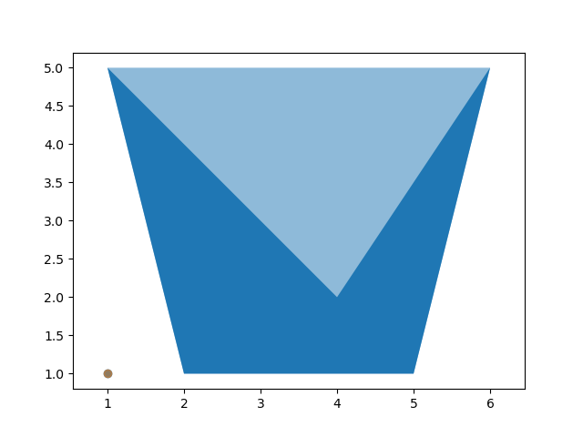
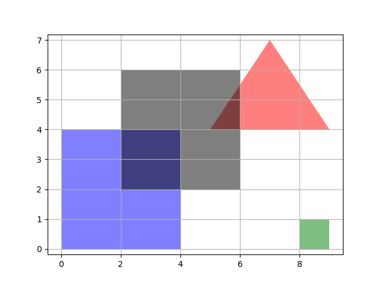
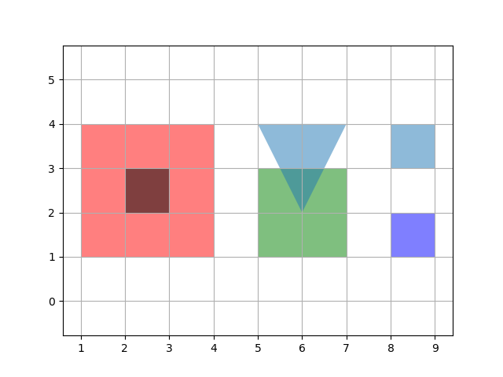
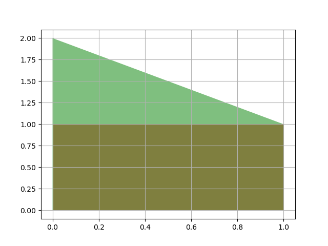
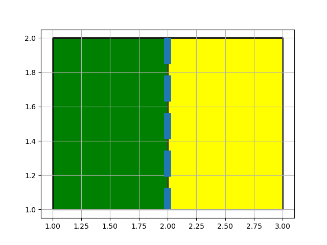

# Basic manipulations of geometry

Arctern implements multiple GIS processing functions that comply with the OGC standard. They are encapsulated as attributes and methods of the GeoSeries class. The methods are divided into unary operation methods and binary operation methods.

## [GeoSeries.length](../../api_reference/standalone_api/api/arctern.GeoSeries.length.html)

* **Function:** Calculates the length of each geometry in the GeoSeries. The ways to calculate the length of geometries are as follows:
  * POINT / MULTIPOINT / POLYGON / MULTIPOLYGON / CURVEPOLYGON / MULTICURVE: 0
  * LINESTRING: Length of a single straight line.
  * MULTILINESTRING: Sum of length of multiple straight lines.
  * CIRCULARSTRING: Length of a single curvilinear line.
  * MULTISURFACE / COMPOUNDCURVE / GEOMETRYCOLLECTION: For a geometry collection among the 3 types, calculates the sum of length of all geometries in the collection.
* **Returns:** Length of each geometry in the GeoSeries.

```python
>>> from arctern import GeoSeries
>>> s = GeoSeries(["POINT(1 1)", "LINESTRING (0 0, 0 2)", "POLYGON ((0 0,0 4,4 4,0 0))"])
>>> s.length
0    0.0
1    2.0
2    0.0
dtype: float64
```

## [GeoSeries.area](../../api_reference/standalone_api/api/arctern.GeoSeries.area.html)

* **Function:** Calculates the 2D Cartesian (planar) area of each geometry in the GeoSeries. The ways to calculate the area of geometries are as follows:
  * POINT / MULTIPOINT / LINESTRING / MULTILINESTRING / CIRCULARSTRING: 0
  * POLYGON: Area of a single polygon.
  * MULTIPOLYGON: Sum of area of multiple polygons.
  * CURVEPOLYGON: Area of a single curvilinear polygon.
  * MULTICURVE: Sum of area of multiple curvilinear polygons.
  * MULTISURFACE / COMPOUNDCURVE / GEOMETRYCOLLECTION: For a geometry collection among the 3 types, calculates the sum of area of all geometries in the collection.
* **Returns:** 2D Cartesian (planar) area of each geometry in the GeoSeries.

```python
>>> from arctern import GeoSeries
>>> s = GeoSeries(["POINT(1 1)", "POLYGON ((2 1, 3 3, 1 3, 2 1))"])
>>> s.area
0    0.0
1    2.0
dtype: float64
```


## [GeoSeries.centroid](../../api_reference/standalone_api/api/arctern.GeoSeries.centroid.html)

* **Function:** Returns the centroid of each geometry in the GeoSeries.
* **Returns:** The centroid of each geometry in the GeoSeries.

```python
>>> from arctern import GeoSeries
>>> s = GeoSeries(["POLYGON ((1 1, 1.5 1, 1.5 1.25, 1 1.25, 1 1))", "POLYGON ((2 1, 3 3, 1 3, 2 1))"])
>>> s.centroid
0              POINT (1.25 1.125)
1    POINT (2.0 2.33333333333333)
dtype: float64
```


## [GeoSeries.is_valid](../../api_reference/standalone_api/api/arctern.GeoSeries.is_valid.html)

* **Function:** Tests whether each geometry in the GeoSeries object is valid.
* **Returns:** Mask of boolean values for each element in the GeoSeries that indicates whether an element is valid.
  * *True:* The geometry is valid.
  * *False:* The geometry is invalid.

```python
>>> from arctern import GeoSeries
>>> s = GeoSeries(["POINT(1 1)", "POINT(1)"])
>>> s.is_valid
0     True
1    False
dtype: bool
```

## [GeoSeries.is_simple](../../api_reference/standalone_api/api/arctern.GeoSeries.is_simple.html)

* **Function:** Tests whether each geometry in the GeoSeries is simple. Here "simple" means that a geometry has no anomalous point, such as a self-intersection or a self-tangency.
* **Returns:** Mask of boolean values for each element in the GeoSeries that indicates whether an element is simple.
  * *True:* The geometry is simple.
  * *False:* The geometry is not simple.

```python
>>> from arctern import GeoSeries
>>> s = GeoSeries(["POINT(1 1)", "LINESTRING (1 2,2 3,1 2,4 6,2 2,1 6)"])
>>> s.is_simple
0     True
1    False
dtype: bool
```


## [GeoSeries.convex_hull](../../api_reference/standalone_api/api/arctern.GeoSeries.convex_hull.html)

* **Function:** For each geometry in the GeoSeries, returns the smallest convex geometry that encloses it.
  * For a polygon, the returned geometry is the smallest convex geometry that encloses it.
  * For a geometry collection, the returned geometry is the smallest convex geometry that encloses all geometries in the collection.
  * For a point or line, the returned geometry is the same as the original.
* **Returns:** Sequence of convex geometries.

```python
>>> from arctern import GeoSeries
>>> s = GeoSeries(["POINT(1 1)", "POLYGON ((2 1, 5 1, 6 5, 4 2, 1 5, 2 1))"])
>>> s.convex_hull
0                        POINT (1 1)
1    POLYGON ((2 1,1 5,6 5,5 1,2 1))
dtype: GeoDtype
```


## [GeoSeries.npoints](../../api_reference/standalone_api/api/arctern.GeoSeries.npoints.html)

* **Function:** Returns the number of points for each geometry in the GeoSeries.
* **Returns:** Number of points of each geometry in the GeoSeries.

```python
>>> from arctern import GeoSeries
>>> s = GeoSeries(["POINT(1 1)", "POLYGON ((1 1, 3 1, 3 3, 1 3, 1 1))"])
>>> s.npoints
0    1
1    5
dtype: int64
```

## [GeoSeries.curve_to_line](../../api_reference/standalone_api/api/arctern.GeoSeries.curve_to_line.html)

* **Function:** Converts curves in each geometry to approximate linear representations. For example,
  * CIRCULAR STRING to LINESTRING,
  * CURVEPOLYGON to POLYGON,
  * MULTISURFACE to MULTIPOLYGON.
* **Returns:** Converted linear geometries.

```python
>>> from arctern import GeoSeries
>>> s = GeoSeries(["CURVEPOLYGON(CIRCULARSTRING(0 0, 4 0, 4 4, 0 4, 0 0))"])
>>> s.curve_to_line()
0    POLYGON ((0 0,0.144384846968599 -0.1346410480079,0.297810064436987 -0.258882339403264,0.459528180167908 -0.372118583103131,0.628751319757384 -0.473798103510646,0.804655045079528 -0.563425528223178,0.986382370866408 -0.640564201436803,1.17304793985397 -0.704838311289649,1.36374233615356 -0.755934720779265,1.55753651583507 -0.793604493334868,1.75348633313513 -0.817664105611044,1.9506371402407 -0.827996341595309,2.14802843823713 -0.824550863672528,2.34469855656221 -0.807344457864786,2.53968933816861 -0.776460952051593,2.73205080756895 -0.732050807568896,2.92084579902018 -0.674330386176507,3.10515452230186 -0.603580895965422,3.28407904384051 -0.520147021340222,3.45674766135266 -0.424435243751333,3.6223191506906 -0.316911861358278,3.7799868642013 -0.198100717271856,3.92898266063321 -0.068580647443195,4.06858064744324 0.071017339366811,4.19810071727193 0.220013135798766,4.31691186135845 0.377680849309456,4.42443524375153 0.543252338647363,4.52014702134033 0.715920956159607,4.60358089596548 0.894845477698254,4.67433038617651 1.07915420097987,4.73205080756907 1.26794919243116,4.77646095205159 1.46031066183144,4.80734445786493 1.65530144343791,4.82455086367258 1.85197156176298,4.82799634159551 2.04936285975941,4.81766410561113 2.24651366686498,4.7936044933349 2.44246348416505,4.75593472077935 2.63625766384655,4.70483831128968 2.82695206014614,4.64056420143697 3.0136176291337,4.56342552822321 3.19534495492053,4.47379810351072 3.37124868024273,4.3721185831032 3.54047181983219,4.2588823394035 3.70218993556301,4.13464104800801 3.85561515303141,4 4,3.85561515303141 4.13464104800801,3.70218993556307 4.25888233940338,3.54047181983219 4.3721185831032,3.37124868024273 4.47379810351072,3.19534495492053 4.56342552822321,3.0136176291337 4.64056420143697,2.82695206014614 4.70483831128968,2.63625766384655 4.75593472077935,2.44246348416505 4.7936044933349,2.24651366686498 4.81766410561113,2.04936285975941 4.82799634159551,1.85197156176298 4.82455086367258,1.65530144343791 4.80734445786493,1.46031066183144 4.77646095205159,1.26794919243116 4.73205080756907,1.07915420097987 4.67433038617651,0.894845477698254 4.60358089596548,0.715920956159607 4.52014702134033,0.543252338647363 4.42443524375153,0.377680849309442 4.31691186135845,0.220013135798759 4.19810071727193,0.071017339366808 4.06858064744324,-0.068580647443198 3.92898266063321,-0.198100717271863 3.7799868642013,-0.316911861358292 3.6223191506906,-0.424435243751333 3.45674766135266,-0.520147021340222 3.28407904384051,-0.603580895965422 3.10515452230175,-0.674330386176507 2.92084579902018,-0.732050807568896 2.73205080756895,-0.776460952051593 2.53968933816861,-0.807344457864786 2.34469855656221,-0.824550863672528 2.14802843823713,-0.827996341595309 1.9506371402407,-0.817664105611044 1.75348633313513,-0.793604493334868 1.55753651583507,-0.755934720779265 1.36374233615356,-0.704838311289649 1.17304793985397,-0.640564201436803 0.986382370866408,-0.563425528223178 0.804655045079528,-0.473798103510646 0.628751319757356,-0.372118583103131 0.459528180167908,-0.258882339403271 0.29781006443698,-0.134641048007893 0.144384846968599,0 0))
dtype: GeoDtype
```


## [GeoSeries.simplify(tolerance)](../../api_reference/standalone_api/api/arctern.GeoSeries.simplify.html)

* **Function:** For each geometry in the GeoSeries object, calculate its simplified representation. The simplified representation algorithm is Douglas-Peucker algorithm.
* **Returns:** GeoSeries

```python
>>> from arctern import GeoSeries
>>> s = GeoSeries(["POLYGON ((1 1,1 2,2 2,2 1,1 1))", "CIRCULARSTRING (0 0,1 1,2 0)"])
>>> s.simplify(1.0)
0    POLYGON ((1 1,1 2,2 2,2 1,1 1))
1               LINESTRING (0 0,2 0)
dtype: GeoDtype
```

## [GeoSeries.envelope](../../api_reference/standalone_api/api/arctern.GeoSeries.envelope.html)

* **Function:** Returns the minimum bounding box for each geometry in the GeoSeries. The bounding box is a rectangular geometry object, and its edges are parallel to the axes.
* **Returns:** Minimum bounding box of each geometry in the GeoSeries.

```python
>>> from arctern import GeoSeries
>>> s = GeoSeries(["POINT(1 1)", "POLYGON ((4.76 3.16, 3.67 5.17, 2.85 2.21, 4.04 0.99, 7.00 2.83))"])
>>> s.envelope
0                                                    POINT (1 1)
1    POLYGON ((2.85 0.99,2.85 5.17,7.0 5.17,7.0 0.99,2.85 0.99))
dtype: GeoDtype
```


## [GeoSeries.buffer(distance)](../../api_reference/standalone_api/api/arctern.GeoSeries.buffer.html)

* **Function:** For each geometry, moves all of its points away from its centroid to construct a new geometry. The distance of movement is specified as `distance`.
  * If `distance` > 0, the new geometry is a scaled-up version outside the original geometry.
  * If `distance` < 0, the new geometry is a scaled-down version inside the original geometry.
* **Returns:** Sequence of geometries.

### Example 1

Setting `distance` to 0 returns an empty polygon.

```python
>>> from arctern import GeoSeries
>>> s = GeoSeries(["POINT (0 1)"])
>>> s.buffer(0.0)
0    POLYGON EMPTY
dtype: GeoDtype
```
### Example 2

Setting `distance` to 1.0 returns a polygon. The polygon approximately represents a circle with a radius of 1.0 and a center of `Point(0, 1)`, and the area of the circle is approximately 3.14.

```python
>>> from arctern import GeoSeries
>>> s = GeoSeries(["POINT (0 1)"])
>>> result = s.buffer(1.0)
>>> result
0    POLYGON ((1 1,0.998629534754574 0.947664043757056,0.994521895368273 0.895471536732347,0.987688340595138 0.843565534959769,0.978147600733806 0.792088309182241,0.965925826289068 0.741180954897479,0.951056516295154 0.690983005625053,0.933580426497202 0.6416320504547,0.913545457642601 0.5932633569242,0.891006524188368 0.546009500260454,0.866025403784439 0.5,0.838670567945424 0.455360964984973,0.809016994374948 0.412214747707527,0.777145961456971 0.370679608950163,0.743144825477395 0.330869393641142,0.707106781186548 0.292893218813453,0.669130606358859 0.256855174522606,0.629320391049838 0.22285403854303,0.587785252292474 0.190983005625053,0.544639035015028 0.161329432054576,0.5 0.133974596215562,0.453990499739548 0.108993475811633,0.406736643075801 0.0864545423574,0.358367949545302 0.066419573502799,0.309016994374949 0.048943483704847,0.258819045102522 0.034074173710932,0.207911690817761 0.021852399266195,0.156434465040233 0.012311659404863,0.104528463267656 0.005478104631727,0.052335956242946 0.001370465245426,0.0 0.0,-0.052335956242941 0.001370465245426,-0.104528463267651 0.005478104631726,-0.156434465040228 0.012311659404862,-0.207911690817756 0.021852399266194,-0.258819045102518 0.034074173710931,-0.309016994374944 0.048943483704845,-0.358367949545297 0.066419573502797,-0.406736643075797 0.086454542357398,-0.453990499739544 0.10899347581163,-0.5 0.13397459621556,-0.544639035015024 0.161329432054574,-0.58778525229247 0.19098300562505,-0.629320391049834 0.222854038543026,-0.669130606358855 0.256855174522603,-0.707106781186544 0.292893218813449,-0.743144825477391 0.330869393641138,-0.777145961456968 0.370679608950159,-0.809016994374944 0.412214747707523,-0.838670567945421 0.455360964984969,-0.866025403784436 0.5,-0.891006524188365 0.546009500260448,-0.913545457642599 0.593263356924195,-0.9335804264972 0.641632050454694,-0.951056516295152 0.690983005625047,-0.965925826289067 0.741180954897473,-0.978147600733804 0.792088309182235,-0.987688340595137 0.843565534959763,-0.994521895368273 0.89547153673234,-0.998629534754574 0.94766404375705,-1.0 1.0,-0.998629534754574 1.05233595624294,-0.994521895368274 1.10452846326765,-0.987688340595139 1.15643446504022,-0.978147600733807 1.20791169081775,-0.96592582628907 1.25881904510251,-0.951056516295156 1.30901699437494,-0.933580426497205 1.35836794954529,-0.913545457642604 1.40673664307579,-0.891006524188372 1.45399049973954,-0.866025403784443 1.5,-0.838670567945429 1.54463903501502,-0.809016994374952 1.58778525229247,-0.777145961456976 1.62932039104983,-0.7431448254774 1.66913060635885,-0.707106781186554 1.70710678118654,-0.669130606358865 1.74314482547739,-0.629320391049845 1.77714596145697,-0.58778525229248 1.80901699437494,-0.544639035015034 1.83867056794542,-0.5 1.86602540378443,-0.453990499739554 1.89100652418836,-0.406736643075807 1.9135454576426,-0.358367949545307 1.9335804264972,-0.309016994374954 1.95105651629515,-0.258819045102528 1.96592582628907,-0.207911690817766 1.9781476007338,-0.156434465040237 1.98768834059514,-0.10452846326766 1.99452189536827,-0.05233595624295 1.99862953475457,-0.0 2.0,0.052335956242939 1.99862953475457,0.104528463267649 1.99452189536827,0.156434465040226 1.98768834059514,0.207911690817755 1.97814760073381,0.258819045102517 1.96592582628907,0.309016994374944 1.95105651629515,0.358367949545297 1.9335804264972,0.406736643075797 1.9135454576426,0.453990499739544 1.89100652418837,0.5 1.86602540378444,0.544639035015025 1.83867056794543,0.587785252292471 1.80901699437495,0.629320391049836 1.77714596145697,0.669130606358857 1.7431448254774,0.707106781186547 1.70710678118655,0.743144825477394 1.66913060635886,0.777145961456971 1.62932039104984,0.809016994374947 1.58778525229247,0.838670567945424 1.54463903501503,0.866025403784439 1.5,0.891006524188368 1.45399049973955,0.913545457642601 1.4067366430758,0.933580426497202 1.3583679495453,0.951056516295154 1.30901699437495,0.965925826289069 1.25881904510252,0.978147600733806 1.20791169081776,0.987688340595138 1.15643446504023,0.994521895368274 1.10452846326765,0.998629534754574 1.05233595624294,1 1))
dtype: GeoDtype
>>> result.area
0    3.140157
dtype: float64
```


## [GeoSeries.precision_reduce(precision)](../../api_reference/standalone_api/api/arctern.GeoSeries.precision_reduce.html)

* **Function:** For the coordinates of each geometry in the GeoSeries, reduces the number of significant digits to the given `precision`. The digit in the last decimal place will be rounded.
* **Returns:** Sequence of geometries with reduced precision.

In the following example, since the effective digits are set to 3, the coordinates of all points in the result retain only 3 valid digits. For the POINT (1.333 2.666) object, the last valid digit of 2.666 is rounded to 2.67.

```python
>>> from arctern import GeoSeries
>>> s = GeoSeries(["POINT (1.333 2.666)", "POINT (2.655 4.447)"])
>>> s.precision_reduce(3)
0    POINT (1.33 2.67)
1    POINT (2.66 4.45)
dtype: GeoDtype
```

## [GeoSeries.make_valid](../../api_reference/standalone_api/api/arctern.GeoSeries.make_valid.html)

* **Function:** Creates a valid representation of each geometry in the GeoSeries without losing any of the input vertices. If the geometry is already-valid, then nothing will be done. If the geometry can't be made to valid, it will be set to None.
* **Returns:** Sequence of valid geometries.

In the following example, the imported geometry is self-intersecting near POINT (2 2). Therefore, the `make_valid` method returns a new union of geometries, which contains a polygon and a line string.

```python
>>> from arctern import GeoSeries
>>> s = GeoSeries(["POLYGON ((2 1,3 1,3 2,2 2,2 8,2 1))"])
>>> s.make_valid()
Warning 1: Self-intersection at or near point 2 2
0    GEOMETRYCOLLECTION (POLYGON ((2 2,3 2,3 1,2 1,2 2)),LINESTRING (2 2,2 8))
dtype: GeoDtype
```

## [GeoSeries.intersects(other)](../../api_reference/standalone_api/api/arctern.GeoSeries.intersects.html)

* **Function:** For each geometry in the GeoSeries and the corresponding geometry given in `other`, tests whether they intersect each other.
* **Returns:** Mask of boolean values for each element in the GeoSeries that indicates whether it intersects the geometries in `other`.
  * *True*: The two geometries intersect each other.
  * *False*: The two geometries do not intersect each other.

### Example 1
```python
>>> from arctern import GeoSeries
>>> s1 = GeoSeries(["POLYGON((7 7,9 4,5 4,7 7))", "POLYGON((8 0,9 0,9 1,8 1,8 0))"])
>>> s2 = GeoSeries(["POLYGON((6 6,2 6,2 2,6 2,6 6))", "POLYGON((0 0,0 4,4 4,4 0,0 0))"])
>>> s2.intersects(s1)
0     True
1    False
dtype: bool
```


### Example 2

```python
>>> from arctern import GeoSeries
>>> s1 = GeoSeries(["POLYGON((7 7,9 4,5 4,7 7))"])
>>> s2 = GeoSeries(["POLYGON((6 6,2 6,2 2,6 2,6 6))", "POLYGON((0 0,0 4,4 4,4 0,0 0))"])
>>> s2.intersects(s1[0])
0     True
1    False
dtype: bool
```


### Example 3

```python
>>> from arctern import GeoSeries
>>> s1 = GeoSeries(["POLYGON((8 0,9 0,9 1,8 1,8 0))"])
>>> s2 = GeoSeries(["POLYGON((6 6,2 6,2 2,6 2,6 6))", "POLYGON((0 0,0 4,4 4,4 0,0 0))"])
>>> s2.intersects(s1[0])
0    False
1    False
dtype: bool
```


## [GeoSeries.within(other)](../../api_reference/standalone_api/api/arctern.GeoSeries.within.html)

* **Function:** For each geometry in the GeoSeries and the corresponding geometry given in `other`, tests whether the first geometry is within the other.
* **Returns:** Mask of boolean values for each element in the GeoSeries that indicates whether it is within the geometries in `other`.
  * *True*: The first geometry is within the other.
  * *False*: The first geometry is not within the other.

```python
>>> s1 = GeoSeries(["POLYGON((1 1, 4 1, 4 4, 1 4, 1 1))", "POLYGON((5 1, 7 1, 7 3, 5 3, 5 1))", "POLYGON((8 1, 9 1, 9 2, 8 2, 8 1))"])
>>> s2 = GeoSeries(["POLYGON((2 2, 2 3, 3 3, 3 2, 2 2))", "POLYGON((5 4, 6 2, 7 4, 5 4))", "POLYGON((8 3, 9 3, 9 4, 8 4, 8 3))"])
>>> s2.within(s1)
0     True
1    False
2    False
dtype: bool
```


## [GeoSeries.contains(other)](../../api_reference/standalone_api/api/arctern.GeoSeries.contains.html)

* **Function:** For each geometry in the GeoSeries and the corresponding geometry given in `other`, tests whether the first geometry contains the other.
* **Returns:** Mask of boolean values for each element in the GeoSeries that indicates whether it contains the geometries in `other`.
  * *True*: The first geometry contains the other.
  * *False*: The first geometry does not contain the other.

```python
>>> from arctern import GeoSeries
>>> s1 = GeoSeries(["POLYGON((2 2, 2 3, 3 3, 3 2, 2 2))", "POLYGON((5 4, 6 2, 7 4, 5 4))", "POLYGON((8 3, 9 3, 9 4, 8 4, 8 3))"])
>>> s2 = GeoSeries(["POLYGON((1 1, 4 1, 4 4, 1 4, 1 1))", "POLYGON((5 1, 7 1, 7 3, 5 3, 5 1))", "POLYGON((8 1, 9 1, 9 2, 8 2, 8 1))"])
>>> s2.contains(s1)
0     True
1    False
2    False
dtype: bool
```


## [GeoSeries.crosses(other)](../../api_reference/standalone_api/api/arctern.GeoSeries.crosses.html)

* **Function:** For each geometry in the GeoSeries and the corresponding geometry given in `other`, tests whether the first geometry spatially crosses the other. "Spatially cross" means two geometries have some, but not all interior points in common. The intersection of the interiors of the geometries must not be the empty set and must have a dimensionality less than the maximum dimension of the two input geometries.
* **Returns:** Mask of boolean values for each element in the GeoSeries that indicates whether it crosses the geometries in `other`.
  * *True*: The first geometry crosses the other.
  * *False*: The first geometry does not cross the other.

```python
>>> from arctern import GeoSeries
>>> s1 = GeoSeries(["POLYGON((1 1, 4 1, 4 4, 1 4, 1 1))", "POLYGON((1 1, 4 1, 4 4, 1 4, 1 1))"])
>>> s2 = GeoSeries(["LINESTRING(1 5, 5 1)", "POLYGON((2 2, 5 2, 5 5, 2 5, 2 2))"])
>>> s2.crosses(s1)
0     True
1    False
dtype: bool
```


## [GeoSeries.geom_equals(other)](../../api_reference/standalone_api/api/arctern.GeoSeries.geom_equals.html)

* **Function:** For each geometry in the GeoSeries and the corresponding geometry given in `other`, tests whether the first geometry equals the other. "Equal" means two geometries represent the same geometry structure.
* **Returns:** Mask of boolean values for each element in the GeoSeries that indicates whether it equals the geometries in `other`.
  * *True*: The first geometry equals the other.
  * *False*: The first geometry does not equal the other.

```python
>>> from arctern import GeoSeries
>>> s1 = GeoSeries(["POLYGON((0 0,1 0,1 1,0 1,0 0))", "POLYGON((8 0,9 0,9 1,8 1,8 0))"])
>>> s2 = GeoSeries(["POLYGON((0 0,0 8,8 8,8 0,0 0))", "POLYGON((0 0,0 8,8 8,8 0,0 0))"])
>>> s2.geom_equals(s1)
0    False
1    False
dtype: bool
```

## [GeoSeries.touches(other)](../../api_reference/standalone_api/api/arctern.GeoSeries.touches.html)

* **Function:** For each geometry in the GeoSeries and the corresponding geometry given in `other`, tests whether the first geometry touches the other. "Touch" means two geometries have common points, and the common points locate only on their boundaries.
* **Returns:** Mask of boolean values for each element in the GeoSeries that indicates whether it touches the geometries in `other`.
  * *True*: The first geometry touches the other.
  * *False*: The first geometry does not touch the other.

```python
>>> from arctern import GeoSeries
>>> s1 = GeoSeries(["POLYGON((1 1, 4 1, 4 5, 1 5, 1 1))"])
>>> s2 = GeoSeries(["POLYGON((4 2, 7 2, 7 6, 4 6, 4 2))"])
>>> s2.touches(s1)
0    True
dtype: bool
```


## [GeoSeries.overlaps(other)](../../api_reference/standalone_api/api/arctern.GeoSeries.overlaps.html)

* **Function:** For each geometry in the GeoSeries and the corresponding geometry given in `other`, tests whether the first geometry "spatially overlaps" the other. "Spatially overlap" here means two geometries intersect but one does not completely contain another.
* **Returns:** Mask of boolean values for each element in the GeoSeries that indicates whether it overlaps the geometries in `other`.
  * *True*: The first geometry overlaps the other.
  * *False*: The first geometry does not overlap the other.

```python
>>> from arctern import GeoSeries
>>> s1 = GeoSeries(["POLYGON((1 1, 4 1, 4 5, 1 5, 1 1))"])
>>> s2 = GeoSeries(["POLYGON((3 2, 6 2, 6 6, 3 6, 3 2))"])
>>> s2.overlaps(s1)
0    True
dtype: bool
```


## [GeoSeries.distance(other)](../../api_reference/standalone_api/api/arctern.GeoSeries.distance.html)

* **Function:** For each geometry in the GeoSeries and the corresponding geometry given in `other`, calculates the minimum 2D Cartesian (planar) distance between them.
* **Returns:** Distance between each geometry in the GeoSeries and the corresponding geometry given in `other`.

```python
>>> from arctern import GeoSeries
>>> s1 = GeoSeries(["LINESTRING(8 0,9 2)", "POINT(10 2)"])
>>> s2 = GeoSeries(["POLYGON((0 0,0 8,8 8,8 0,0 0))", "POLYGON((0 0,0 8,8 8,8 0,0 0))"])
>>> s2.distance(s1)
0    1.0
1    2.0
dtype: float64
```


## [GeoSeries.distance_sphere(other)](../../api_reference/standalone_api/api/arctern.GeoSeries.distance_sphere.html)

* **Function:** For each point in the GeoSeries and the corresponding point given in `other`, calculates the minimum spherical distance between them. This function uses a spherical earth and radius derived from the spheroid defined by the SRID.
* **Returns:** Spherical distance between each geometry in the GeoSeries and the corresponding geometry given in `other`.

```python
>>> from arctern import GeoSeries
>>> s1 = GeoSeries(["POINT(10 2)"], crs="EPSG:4326")
>>> s2 = GeoSeries(["POINT(10 3)"], crs="EPSG:4326")
>>> s2.distance_sphere(s1)
0    111226.3
dtype: float64
```

## [GeoSeries.hausdorff_distance(other)](../../api_reference/standalone_api/api/arctern.GeoSeries.hausdorff_distance.html)

* **Function:** For each point in the GeoSeries and the corresponding point given in `other`, calculates the Hausdorff distance between them. Hausdorff distance is a measure of how similar two geometries are.
* **Returns:** Hausdorff distance between each geometry in the GeoSeries and the corresponding geometry given in `other`.

```python
>>> from arctern import GeoSeries
>>> s1 = GeoSeries(["POLYGON((0 0 ,0 1, 1 1, 1 0, 0 0))", "POINT(0 0)"])
>>> s2 = GeoSeries(["POLYGON((0 0 ,0 2, 1 1, 1 0, 0 0))", "POINT(0 1)"])
>>> s2.hausdorff_distance(s1)
0    1.0
1    1.0
dtype: float64
```


## GeoSeries.intersection(other)

* **Function:** For each point in the GeoSeries and the corresponding point given in `other`, calculates the intersection of them.
* **Returns:** Intersection of each geometry in the GeoSeries and the corresponding geometry given in `other`.

```python
>>> from arctern import GeoSeries
>>> s1 = GeoSeries(["POLYGON ((1 1,1 2,2 2,2 1,1 1))"])
>>> s2 = GeoSeries(["POLYGON ((2 1,3 1,3 2,2 2,2 1))"])
>>> s2.intersection(s1)
0    LINESTRING (2 2,2 1)
dtype: GeoDtype
```


## [GeoSeries.polygon_from_envelope(cls, min_x, min_y, max_x, max_y, crs=None)](../../api_reference/standalone_api/api/arctern.GeoSeries.polygon_from_envelope.html)

* **Function:** Constructs rectangular POLYGON objects within the given spatial range. The edges of the rectangles are parallel to the coordinate axises. ``min_x``, ``min_y``, ``max_x``, and ``max_y`` are Series so that polygons can be created in batch. The number of values in the four Series should be the same. Suppose that the demension of ``min_x`` is *N*, the returned GeoSeries of this function should contains *N* rectangles. The shape and position of the rectangle with index *i* is defined by its bottom left vertex *(min_x[i], min_y[i])* and top right vertex *(max_x[i], max_y[i])*.
* **Returns:** Sequence of rectangular POLYGON objects within the given spatial range.

```python
>>> from pandas import Series
>>> from arctern import GeoSeries
>>> min_x = Series([0.0, 1.0])
>>> max_x = Series([2.0, 1.5])
>>> min_y = Series([0.0, 1.0])
>>> max_y = Series([1.0, 1.5])
>>> GeoSeries.polygon_from_envelope(min_x, min_y, max_x, max_y)
0                POLYGON ((0 0,0 1,2 1,2 0,0 0))
1    POLYGON ((1 1,1.0 1.5,1.5 1.5,1.5 1.0,1 1))
dtype: GeoDtype
```


## [GeoSeries.point(x, y)](../../api_reference/standalone_api/api/arctern.GeoSeries.point.html)

* **Function:** Constructs POINT objects based on the given coordinates. `x` and `y` are Series so that points can be created in batch. The number of values in the two Series should be the same. Suppose that the demension of `x` is *N*, the returned GeoSeries of this function should contains *N* points. The position of the *i*th point is defined by its coordinates *(x[i], y[i]).*
* **Returns:** Sequence of POINT objects.

```python
>>> from pandas import Series
>>> from arctern import GeoSeries
>>> x = Series([1.3, 2.5])
>>> y = Series([1.3, 2.5])
>>> GeoSeries.point(x, y)
0    POINT (1.3 1.3)
1    POINT (2.5 2.5)
dtype: GeoDtype
```
