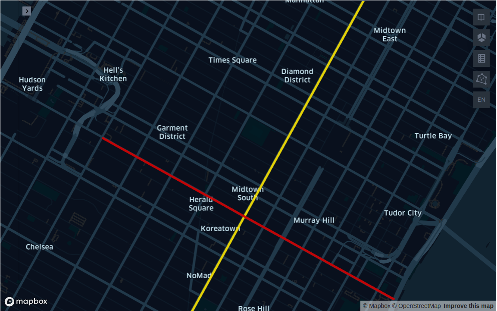
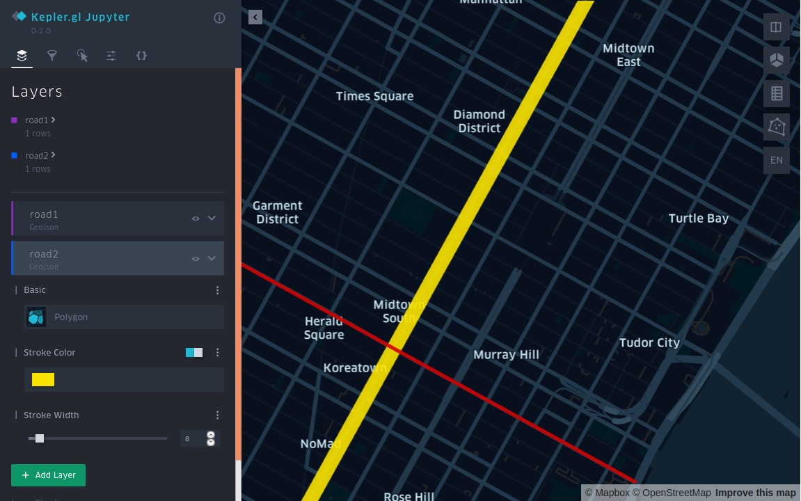

# Using Arctern to analyze spatial data

If you have completed the [installation and deployment of Arctern](./installation.md), this guide will walk you through analyzing the road information near the Empire State Building via Arctern.

### Installing Jupyter and Kepler.Gl

In the next sections, you need to use Jupyter Notebook for running Python codes and Kepler.Gl for visualizing spatial data. Follow the steps below to install Jupyter and Kepler.Gl:

Enter the Conda environment:

```bash
$ conda activate arctern_env
```

Install Jupyter and Kepler.Gl:

```bash
$ conda install -c conda-forge jupyterlab
$ pip install keplergl
```

## Running Jupyter Notebook

Run Jupyter Notebook in the Conda environment, and it will open a page in your default browser.

```bash
$ jupyter-notebook
```

Click **New &gt; Python3** at the top right corner of the page to create a new notebook.

## Running Arctern

### Using Arctern to analyze road information

> **Note:** Run the following operations in the newly created Notebook.

Import `arctern`, `keplergl` and other related libraries:

```python
>>> from keplergl import KeplerGl
>>> import pandas as pd
>>> import arctern
```

Create two LINESTRING objects (`road1`, `road2`) in WKT format based on the two roads near the Empire State Building:

```python
>>> # The latitude and longitude coordinates of the two ends of road1 are (-73.996324, 40.753388) and (-73.972088, 40.743215).
>>> # The latitude and longitude coordinates of the two ends of road2 are (-73.989555, 40.741531) and (-73.973952, 40.762962).
>>> road1 = 'LINESTRING (-73.996324 40.753388, -73.972088 40.743215)'
>>> road2 = 'LINESTRING (-73.989555 40.741531, -73.973952 40.762962)'
```

Use `arctern.ST_Intersects` to check whether `road1` and `road2` intersect.

* _True:_ the two roads intersect.
* _False:_ the two roads do not intersect.

```python
>>> arctern.ST_Intersects(arctern.ST_GeomFromText(road1), arctern.ST_GeomFromText(road2))
0    True
dtype: bool
```

### Using Kepler.Gl to create a map

Use Kepler.Gl to plot `road1` and `road2` on a map, and check if the two roads intersect:

```python
>>> KeplerGl(height=600,data={"road1": pd.DataFrame(data={"road1":[road1]}),
                          "road2": pd.DataFrame(data={"raod2":[road2]})})
```



You can also click **&gt;** at the top right corner of the Kepler.Gl interface to expand the sidebar and change the color and line width of each road.

